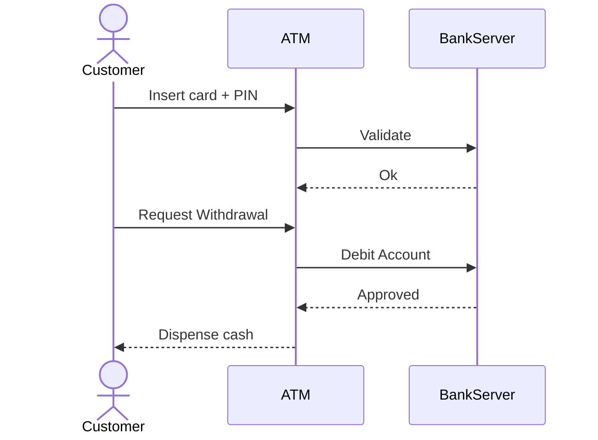

# Module 1 — Introduction to Software Architecture

Objective: Understand the basics and importance of software architecture, and how architecture decisions influence the system lifecycle, team organization, and non-functional requirements.

Navigation: [Overview](00-Overview.md) • [Next: Module 2](Module-02-SOLID-Cpp-BestPractices.md)

## 1.1 Definition and significance of software architecture

Software architecture is the set of high-level design decisions that shape a software system — the components and modules, how they interact, the boundaries between concerns, and the runtime topology. It sits above source code and below organizational strategy: architecture decisions drive how teams collaborate, what testing looks like, and how the product evolves.

Concrete real-world example — online payments platform:

- Decision: perform payment authorization in a separate microservice with a clearly defined API versus embedding it into the web frontend.
- Rationale: this isolates sensitive logic, enables independent scaling of the payment pipeline, allows focused security audits, and enables multiple teams to independently evolve payment integration.

Consequence: a good architectural decision reduces coupling between the UI and payment logic and shortens the path to regulatory compliance and safe deployment.

## 1.2 Key qualities

Architects reason about a set of measurable or qualitative attributes that define success for the system. These are often called "quality attributes":

- Maintainability — How easily can engineers modify, extend, and diagnose the system? Example: In a network device firmware project, maintainability is driven by clear module boundaries and reproducible builds so safety-critical fixes can be issued quickly.
- Scalability — How does the system accommodate more users, data, or throughput? Example: an analytics pipeline might use partitioned data stores and stateless workers to horizontally scale processing when ingestion doubles.
- Performance — Do latency and throughput meet requirements? Example: High-frequency trading systems use lock-free data structures and careful CPU affinity to meet sub-microsecond latencies.
- Security — How does the design limit attack surface and reduce risk? Example: a medical-device controller isolates patient-identifying data in a hardened service and applies strict authentication and audit logging.

Trade-offs: improving one quality attribute (e.g., raw performance) can make others worse (e.g., maintainability), so architects formalize expectations and measurable objectives early.

## 1.3 Role of a software architect

A software architect is a decision-maker and communicator whose job is to ensure the system meets both functional requirements and quality attributes. Typical responsibilities include:

- Eliciting non-functional requirements and turning them into measurable objectives (SLOs – Service Level Objectives).
- Selecting frameworks, communication protocols (gRPC, REST), and cross-cutting infrastructure (logging, monitoring) that align to goals.
- Establishing boundaries (modules, services) that map to team ownership and release strategies.
- Running architecture reviews and mentoring developers to apply patterns consistently.

Concrete example — migrating a monolithic analytics app to a service-based architecture:

- Architect responsibilities: define service boundaries (ingest, enrichment, persistence), draft data contracts, propose migration plan with backward compatibility and a feature flag rollout, and define monitoring to validate performance and correctness post-migration.

Impact: the architect prevents one large team from making rushed changes that would cause systemic regressions and instead ensures the migration is staged, reversible, and observable.

## 1.4 Introduction to UML diagrams

UML (Unified Modeling Language) and other diagramming notations are used to communicate architecture. The goal is to reduce ambiguity by showing interaction flows, responsibilities, and data ownership.

Key diagrams and practical uses:
- Use Case — identify the actors and the features they need; useful in requirements elicitation and validating that major use paths exist.
- Class Diagram — maps classes/modules in OO systems; helps make dependencies and ownership explicit, which is useful for low-level design and impact analysis.
- Sequence Diagram — illustrates runtime interaction and helps reason about latency, synchronization and failure modes (e.g., what if a downstream service times out?).

Concrete example — ATM withdrawal flow (why sequence diagrams matter):



This sequence diagram captures critical interaction points where latency or failures can occur (network between ATM and BankServer), and it clarifies where to add retries, timeouts, and observability.

### Example: Simple Bank Use Case (mermaid sequence)


### Concrete C++ example: responsibilities separation (real life reasoning)

Below is a minimal example showing separation of concerns between persistence, business logic and presentation — inspired by a retail point-of-sale system. The persistence interface can be implemented by an in-memory store in unit tests and by a database adapter in production.

```cpp
#include <iostream>
#include <string>

// Persistence layer (interface) — implemented differently for tests and production
struct IAccountStore {
    virtual ~IAccountStore() = default;
    virtual double getBalance(const std::string &id) = 0;
    virtual void debit(const std::string &id, double amount) = 0;
};

// Business layer — enforces domain rules
class AccountService {
    IAccountStore &store;
public:
    explicit AccountService(IAccountStore &s): store(s) {}
    // Withdraw returns false on insufficient funds — keeps policy logic here
    bool withdraw(const std::string &id, double amount) {
        double bal = store.getBalance(id);
        if (bal < amount) return false; // business rule
        store.debit(id, amount);
        return true;
    }
};

// Small demonstration: in a real POS system the UI is separate and could
// be a terminal, GUI or a network-facing API.
int main(){
    std::cout << "This lecture demonstrates separation of concerns in architecture." << std::endl;
}
```

---

---

Further reading and thought prompts (optional): think about how your architecture decisions map to team ownership, testability, and deployment timelines.
