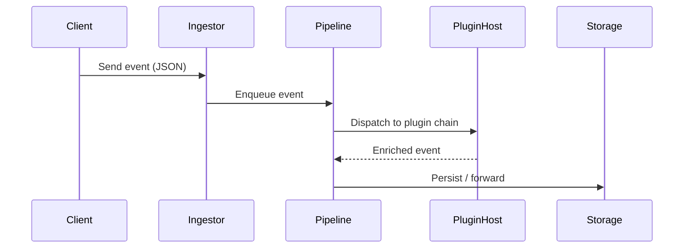

# Module 8 — Case Studies and Final Project

Objective: Apply knowledge to design, evaluate and implement a production-ready architecture for a real-world C++ system and understand trade-offs through detailed case studies.

Navigation: [Prev: Module 7](Module-07-Testing-Quality.md) • [Back to Overview](00-Overview.md)

## 8.1 Analyzing open-source C++ project architectures

Studying mature open-source projects exposes patterns and engineering trade-offs at scale. Below are brief analyses of representative projects and what architectural lessons you can learn from them.

- LLVM (compiler infrastructure): modular components (frontends, optimizer, codegen), strong focus on stable C APIs for tool integration, extensive use of IR for decoupled analysis and transformations. Lesson: use an intermediate representation to separate front-ends from back-ends and enable many independent tools.
- LevelDB (storage engine): compact, focused design for key-value storage with pluggable comparators and a well-defined storage format (SSTables). Lesson: decide a small, well-defined responsibility, make the data-format stable and provide utilities for safe upgrades.
- Chromium (browser): multi-process design, sandboxing, and fine-grained module isolation. Lesson: isolate untrusted workloads and design robust IPC and fault-tolerance.

Other good projects to study: RocksDB (advanced storage), gRPC (network stack patterns), and Folly / Abseil (modern C++ utilities and idioms).

## 8.2 Designing and implementing an architecture for a specific use case

Final Project idea: Implement a simplified event-driven telemetry collector (telemetry daemon) in C++ with a plugin architecture for enrichment/consumers. The goal is to design a clean, testable, and scalable prototype that demonstrates architectural decisions.

Core requirements and rationales:

- Ingest: accept JSON or binary events over TCP/HTTP for broad compatibility. Keep ingestion as a thin front-end to avoid coupling with downstream logic.
- Transit: deserialize events, enforce schema validation, and add lightweight enrichment (geo lookups, timestamps). Keep these operations in the pipeline as small, composable stages.
- Process: apply pluggable transforms and filters (plugin hooks). A plugin system lets teams add domain-specific enrichment without modifying core code.
- Export: write events to storage or downstream systems (file, local DB, or a message broker) and provide backpressure/circuit-breaker for overload.

Suggested architecture and components (high-level):

- Ingestors (network-facing processes)
- Dispatcher / pipeline manager (queues and worker pools)
- Plugin host/registry (loads plugins and manages lifecycle)
- Outputs (emitters to storage/message bus)

Project layout (suggested):

```
telemetry/
  core/
    include/telemetry/  # public headers and interface definitions
    src/
    CMakeLists.txt
  plugins/
    enrich_plugin/
    forwarder_plugin/
  app/
    src/main.cpp       # service bootstrap, plugin wiring
  tests/
  CMakeLists.txt
```

High-level interaction (sequence diagram):



Plugin API (sketch):

```cpp
struct IPlugin {
  virtual ~IPlugin() = default;
  virtual std::string name() const = 0;
  virtual Event onEvent(const Event &in) = 0; // transform or return unchanged
};

// Plugin registry returns std::unique_ptr<IPlugin> and plugins run in confined address space
```

Testing & delivery:

- Unit tests for pipeline stages and plugin contracts
- Integration tests using ephemeral stores and a simulated ingest workload
- CI pipeline for cross-platform builds, sanitizer checks, and integration test runs

Scaling considerations:

- Horizontal scaling of ingestors and worker pools; stateless ingestors enable simple scaling.
- Use partitioning/sharding for event storage and multi-tenant isolation where required.
- Consider adaptive sampling, graceful degradation, and rate-limiting in peak loads.

## 8.3 Presenting, reviewing and extending the final project

Deliverables for a polished final project:

- Design document describing the overall architecture, key trade-offs, component diagrams, and data contracts.
- Working prototype with build and run instructions, and a small dataset for validation.
- Tests: unit tests for core components and integration tests for end-to-end validation.
- CI configuration to run build, tests, static checks, and sanitizer-enabled unit tests.
- A short demo or recorded walkthrough explaining design choices and demonstrating system behavior under different load patterns.

Optional extensions to demonstrate advanced architecture decisions:

- Add runtime plugin isolation (separate processes or sandboxing) to prevent buggy plugins from taking down the core service.
- Implement pluggable persistence backends and show a performance comparison (file, SQLite, message broker).
- Multi-tenant routing and policy enforcement for isolation and quotas.

---

Conclusion: The final project should demonstrate how to translate architecture decisions into a concrete, testable C++ implementation while balancing performance, observability, and team productivity.
